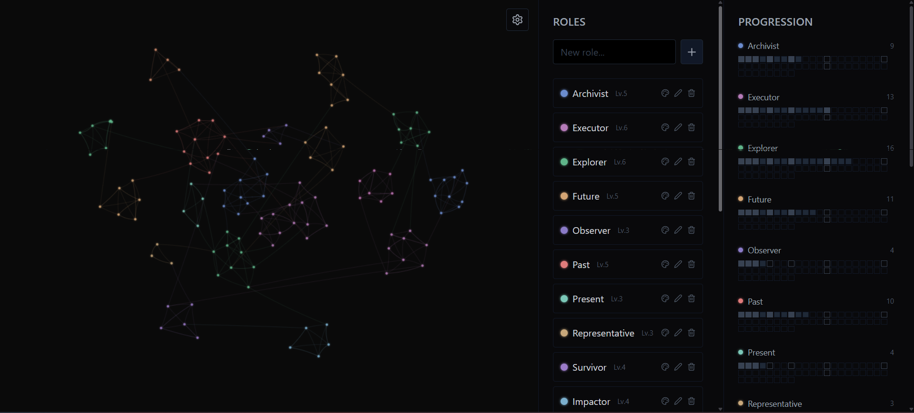

# Skill Web Tracker

A minimal, canvas-based skill tracking and visualization tool built with **React**, **Vite**, and **Tailwind CSS**.

It lets you map skills as points in a dynamic web, group them by roles, and track long-term progression using simple milestone logic.

## Live Demo

👉 **https://levkobe.github.io/skill-web-tracker/**

## Preview

> Example of how the tracker may look during use:



## Features

- Interactive canvas with animated nodes and curved connections
- Role-based grouping of skills
- Progression tracking using Fibonacci milestones
- Drag to pan the canvas
- Save / load state as JSON
- Minimal UI, no backend, fully local

## How It Works (Usage Flow)

1. **Create roles**
   Add roles (e.g. Development, Design, Writing) in the middle panel.

2. **Activate a role**
   Click a role to make it active.

3. **Map skills visually**
   Click on the canvas to add skill points for the active role.
   Nearby points connect automatically.

4. **Explore & navigate**
   Drag the canvas to pan and explore your skill web.

5. **Track progression**
   The right panel shows progression per role with milestone markers.

6. **Persist your data**
   Save your state as a `.json` file and load it back anytime. (Available in the Roles Panel)

## Tech Stack

- React
- Vite
- Tailwind CSS
- Canvas API
- lucide-react (icons)

## Project Structure

```
src/
├─ components/         # Reusable UI components
│  └─ RoleItem.jsx
│
├─ panels/             # Main UI panels
│  ├─ RolesPanel.jsx
│  ├─ ProgressionPanel.jsx
│  ├─ SettingsPanel.jsx
│  └─ WebCanvas.jsx
│
├─ data/               # Static (initial) data
│  └─ roles.js
│
├─ SkillWebTracker.jsx # Main feature container
├─ App.jsx
├─ main.jsx
└─ index.css
```

## Getting Started

### Clone and open the repo

```bash
git clone https://github.com/LevkoBe/skill-web-tracker.git
cd skill-web-tracker
```

### Install dependencies

```bash
npm install
```

### Run dev server

```bash
npm run dev
```

Open `http://localhost:5173` in your browser.

## Notes

- All state is local (no persistence unless exported)
- Designed as an experimental / personal visualization tool
- Layout and visuals rely heavily on Tailwind utility classes
- Best experienced on desktop

## License

MIT
